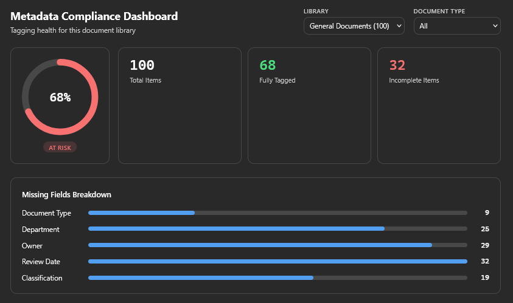
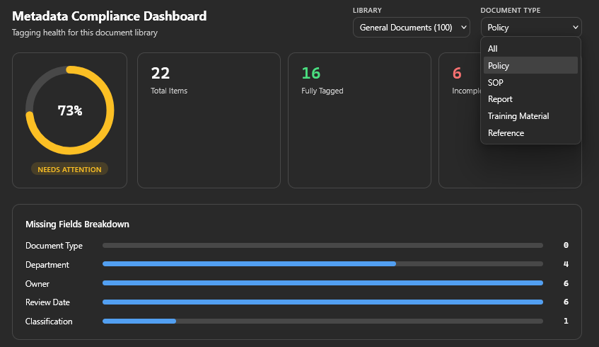
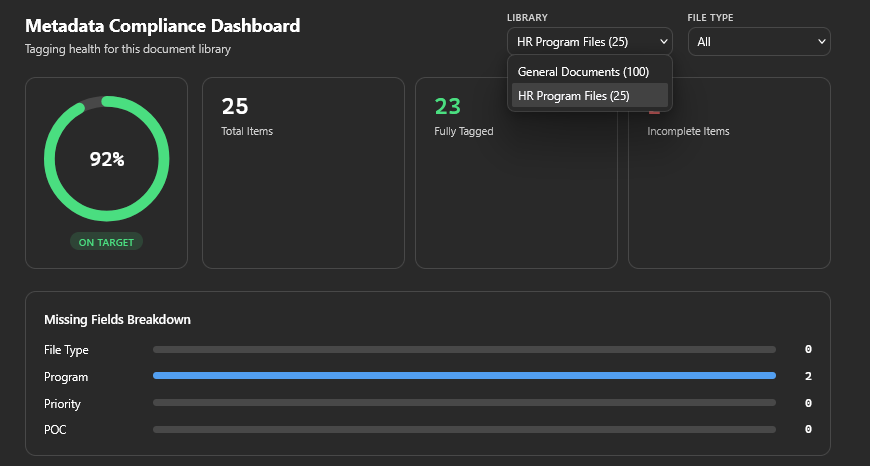
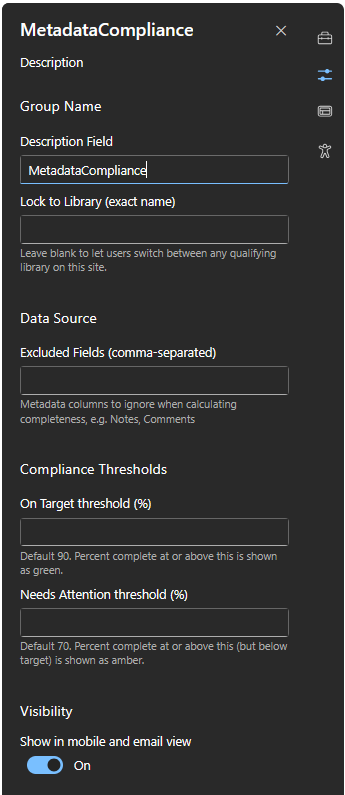
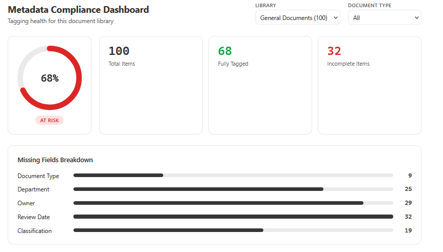

# Metadata Compliance Dashboard

An SPFx web part that scans a SharePoint document library and shows how well it's actually tagged. It reports the percentage of items with complete metadata, breaks down which fields are missing most often, and lets you filter by content type. Built with React, TypeScript, and PnPjs.



## Why this exists

Most SharePoint document libraries look organized on the surface but have inconsistent metadata underneath: missing owners, blank review dates, documents with no classification. That gap is invisible until someone actually needs to search, report on, or migrate that content, and by then it's a much bigger cleanup job.

This project grew out of real migration work managing a 740,000+ file SharePoint migration where metadata tagging accuracy was tracked as a hard requirement (96% on one 36,000+ file migration). A dashboard like this is the kind of tool that would have made that tracking visible in real time instead of after the fact, via a spreadsheet export.

## What it does

- Scans a document library and calculates what percentage of items have every required metadata field filled in
- Automatically discovers a library's custom metadata columns instead of assuming a fixed schema, so it works across libraries with completely different fields
- Skips libraries that have no custom metadata to evaluate, rather than erroring out
- Breaks down exactly which fields are causing the most gaps
- Filters by a content-type-style column when the library has one
- Color-codes the result (on target / needs attention / at risk) against configurable thresholds
- Adapts to light and dark SharePoint site themes automatically





## Configuration

The web part's property pane lets a site owner adjust it per instance without touching code:

- Lock the dashboard to a specific library, or leave it open so users can switch between any library that has custom metadata
- Exclude specific fields from the completeness calculation (useful for optional fields like internal notes)
- Set custom thresholds for what counts as "on target" versus "at risk"





## How it's built

- **SPFx 1.23** web part, React function components with hooks
- **PnPjs** for all SharePoint REST calls (no raw fetch, no hand-built OData strings)
- **TypeScript** throughout, strict interfaces for every SharePoint response shape
- Custom SVG progress ring, no charting library dependency
- SCSS driven by CSS custom properties, so the same styles adapt automatically to a site's real color theme via `onThemeChanged`
- Zero external font or asset dependencies, everything ships inside the compiled bundle

### How the library discovery works

On load, the web part queries every document library on the site, checks each one's field schema, and filters out SharePoint's own system columns (things like Created, Modified, Content Type) using a combination of naming convention and field metadata. Whatever custom columns are left become the metadata the dashboard evaluates. A library with no custom columns is skipped from the picker instead of showing an error.

## Known limitations

- Item scanning is capped per library (SharePoint's REST API has practical limits on how many items come back in a single call). True paging for very large libraries is on the roadmap, not yet built.
- Per-instance color and font customization was attempted but pulled before shipping after it caused an intermittent SPFx load failure tied to applying styles during the web part's render cycle. The data-focused configuration options (library lock, thresholds, excluded fields) all work correctly. This is a good candidate for a follow-up fix using a safer styling approach.
- No cross-site aggregation. Each instance reports on libraries within the site it's deployed to. A tenant-wide rollup across multiple sites is a reasonable next step but would need Microsoft Graph with broader permissions, which is a real conversation to have with a tenant admin before building, especially in a DoD or GCC High environment.

## Deployment notes for DoD / GCC High environments

- All data calls go through SharePoint's own REST API via PnPjs. There are no calls to Microsoft Graph, no external APIs, and no third-party CDN dependencies in the shipped bundle, which matters in tenants that block outbound calls to unapproved domains.
- Deploys cleanly through a site collection app catalog, so it doesn't require a tenant-wide admin approval to pilot on a single site.
- No premium connectors, no Dataverse, no custom connector usage, so it doesn't run into the DLP policies that commonly block Power Platform automation in restricted tenants.

## Local development

```
npm install
npm run start
```

Requires Node 22.x. Opens the SharePoint hosted workbench for local debugging against a real tenant (SPFx removed local-only workbench support in newer versions).

To package for deployment:

```
npm run build
```

This produces a `.sppkg` file in `sharepoint/solution`, ready to upload to a SharePoint app catalog.
